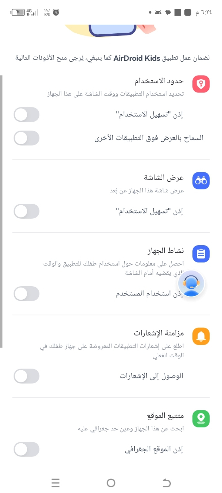
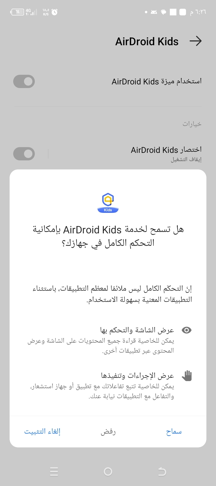
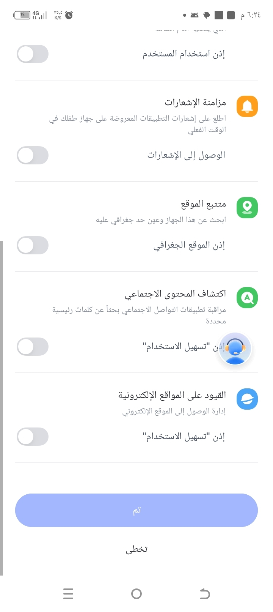
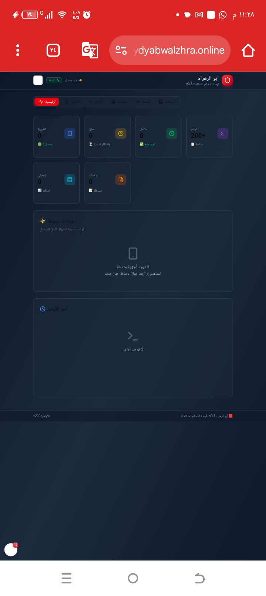
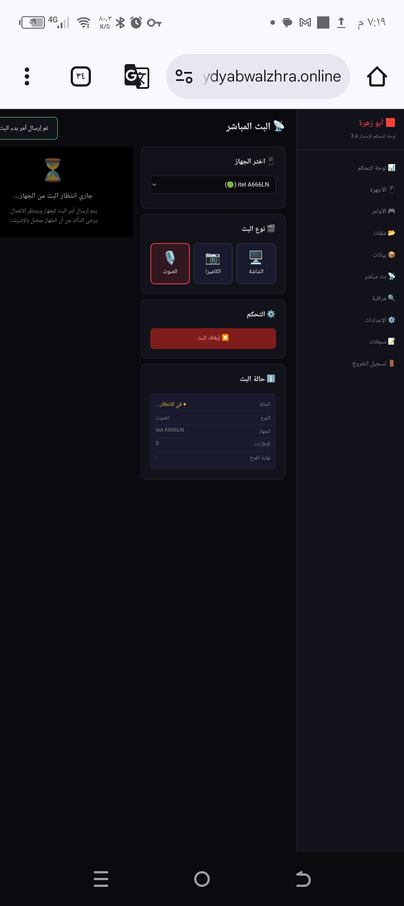
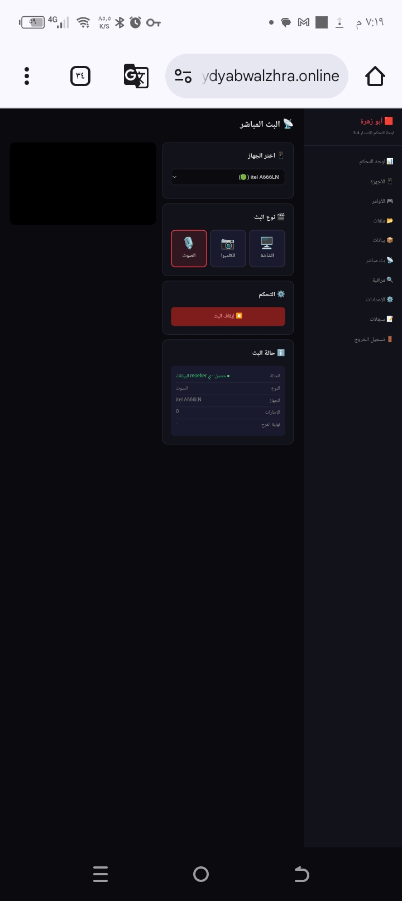

# Abu Zahra Admin

<div align="center">


نظام إدارة وتحكم متكامل للأجهزة عن بُعد — يتكون من تطبيق Android وسيرفر Python مع لوحة تحكم ويب مدمجة وبوت Telegram.

A comprehensive remote device management and control system — consisting of Android apps, a Python server, an embedded web dashboard, and a Telegram bot.

</div>

---

## 📸 لقطات الشاشة | Screenshots

| | | |
|---|---|---|
|  |  |  |
|  |  |  |

> المزيد من لقطات الشاشة متوفرة في مجلد `upload/`

---

## 📁 هيكل المشروع | Project Structure

```
Abu-Zahra-Admin/
├── Server/                         # Python aiohttp Server
│   ├── main.py                     # Entry point & route definitions
│   ├── requirements.txt            # Python dependencies
│   └── modules/
│       ├── config.py               # Configuration (env vars)
│       ├── store.py                # In-memory data store
│       ├── api_handlers.py         # REST API & WebSocket handlers
│       ├── firebase_client.py      # Firebase Realtime DB client
│       ├── telegram_bot.py         # Telegram bot integration
│       ├── commands.py             # Command definitions & registry
│       ├── file_storage.py         # File upload/download management
│       └── dashboard_html.py       # Embedded web dashboard
│
├── Admin-App/                      # Android Admin App (Kotlin)
│   └── app/src/main/java/com/abuzahra/admin/
│       ├── data/
│       │   ├── api/                # API client, models
│       │   └── model/              # Data models
│       ├── ui/
│       │   ├── dashboard/          # Dashboard screen
│       │   ├── device/             # Device detail, commands, events
│       │   ├── files/              # File browser
│       │   ├── login/              # Authentication
│       │   └── settings/           # App settings
│       └── util/                   # Preferences, notifications
│
├── Android-App/                    # Android Client App (Kotlin)
│   └── app/src/main/java/com/abuzahra/manager/
│       ├── api/                    # API & Firebase clients
│       ├── executor/               # Command executors (8 modules)
│       ├── service/                # Background services (8 services)
│       ├── streaming/              # Live streaming (screen, camera, audio)
│       ├── storage/                # File management (backup, zip, archive)
│       ├── database/               # Room Database (entities, DAOs)
│       ├── worker/                 # WorkManager tasks
│       ├── permission/             # Permission management
│       ├── sync/                   # Data sync
│       ├── repository/             # Repository pattern
│       ├── model/                  # Data models
│       └── util/                   # Utilities
│
├── Releases/                       # Versioned APK releases
├── download/                       # Build outputs
├── upload/                         # Screenshots & media
└── .gitignore
```

---

## 🚀 التثبيت والإعداد | Installation & Setup

### 1. السيرفر | Server

```bash
cd Server

# Create virtual environment
python3 -m venv venv
source venv/bin/activate

# Install dependencies
pip install -r requirements.txt

# Configure environment variables
cp .env.example .env
# Edit .env with your actual values:
#   BOT_TOKEN, ADMIN_CHAT_ID, FIREBASE_PROJECT, FIREBASE_DB_SECRET, ADMIN_PASSWORD
```

#### متغيرات البيئة المطلوبة | Required Environment Variables

| Variable | Description |
|----------|-------------|
| `BOT_TOKEN` | Telegram bot token from @BotFather |
| `ADMIN_CHAT_ID` | Telegram admin chat ID |
| `FIREBASE_PROJECT` | Firebase project ID |
| `FIREBASE_DB_SECRET` | Firebase Realtime DB secret |
| `ADMIN_PASSWORD` | Admin panel password |
| `SERVER_HOST` | Server bind address (default: `0.0.0.0`) |
| `SERVER_PORT` | Server port (default: `8443`) |

```bash
# Run the server
python3 main.py
```

### 2. تطبيق الأدمن | Admin App

```bash
cd Admin-App

# Build debug APK
./gradlew assembleDebug

# APK output: app/build/outputs/apk/debug/
```

- **minSdk:** 26 (Android 8.0) | **targetSdk:** 34 (Android 14)
- Connects to the server via REST API for device management

### 3. تطبيق العميل | Android Client App

```bash
cd Android-App

# Build debug APK
./gradlew assembleDebug

# APK output: app/build/outputs/apk/debug/
```

- **minSdk:** 24 (Android 7.0) | **targetSdk:** 34 (Android 14)
- Links to server via pairing code
- Communicates via Firebase Realtime Database + REST API

---

## ✨ الميزات | Features

### 🖥️ لوحة التحكم | Web Dashboard
- Embedded web dashboard served directly by the Python server
- Real-time device monitoring via WebSocket
- Command execution and event streaming

### 🤖 بوت Telegram
- Real-time notifications for device events
- Remote command execution via chat
- Battery alerts and device status updates

### 📱 تطبيق Android (العميل)
- **Data Collection:** SMS, calls, contacts, app logs, GPS locations
- **Remote Control:** Screenshot, front/back camera, audio recording
- **App Management:** Install, uninstall, open, force-stop
- **File Management:** Upload, download, delete, rename, copy, move
- **Live Streaming:** Screen, camera, audio with adaptive bitrate
- **Security:** AES encryption, device lock, data wipe
- **Monitoring:** Keylogger, notification interception, app tracking

### 📋 تطبيق الأدمن
- Device dashboard with online/offline status
- Send commands to devices
- Browse events and command history
- File browser for uploaded files
- User management

### 🔗 الربط والتواصل | Communication
- Device pairing via 8-character link codes
- Firebase Realtime Database for real-time command/result exchange
- REST API for file transfers and web dashboard
- WebSocket for live updates

---

## 🏗️ البنية التقنية | Tech Stack

| Component | Technology |
|-----------|-----------|
| Server | Python 3 / aiohttp |
| Client App | Kotlin / Android SDK / Room / WorkManager |
| Admin App | Kotlin / Android SDK / Retrofit / MVVM |
| Real-time | Firebase Realtime Database |
| Streaming | WebRTC / MediaCodec / Adaptive Bitrate |
| Notifications | Telegram Bot API |
| Authentication | JWT tokens |

---

## 📦 النشر | Deployment

```bash
# As systemd service (example)
sudo cp abuzahra.service /etc/systemd/system/
sudo systemctl enable abuzahra
sudo systemctl start abuzahra
```

- **Domain:** alsydyabwalzhra.online
- **Port:** 8443 (HTTPS via reverse proxy)

---

## 📄 الترخيص | License

Private project — all rights reserved.